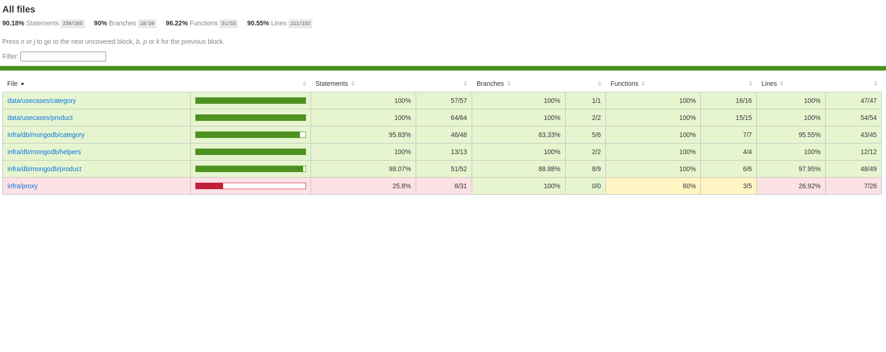

# **Anota-Ai-App**

> ## Princípios Implementados (Ou quase)

* Single Responsibility Principle (SRP)
* Open Closed Principle (OCP)
* Liskov Substitution Principle (LSP)
* Interface Segregation Principle (ISP)
* Dependency Inversion Principle (DIP)
* Keep It Simple, Silly (KISS)
* Small Commits

> ## Design Patterns

* Factory
* Decorator
* Proxy
* Dependency Injection

> ## Metodologias e Designs

* TDD
* Clean Architecture
* DDD
* Conventional Commits
* Use Cases
* Continuous Integration

> ## Bibliotecas e Ferramentas

* NPM
* Typescript
* Git
* Docker
* Jest
* MongoDb
* Husky
* Lint Staged
* Eslint
* Standard Javascript Style

> ## Testes quase 100%

* Testes Unitários
* Mocks
* Stubs
* Spies
* Fakes

