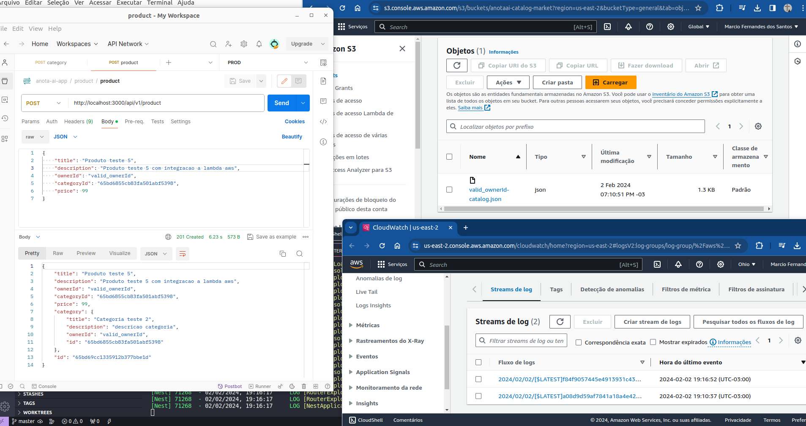
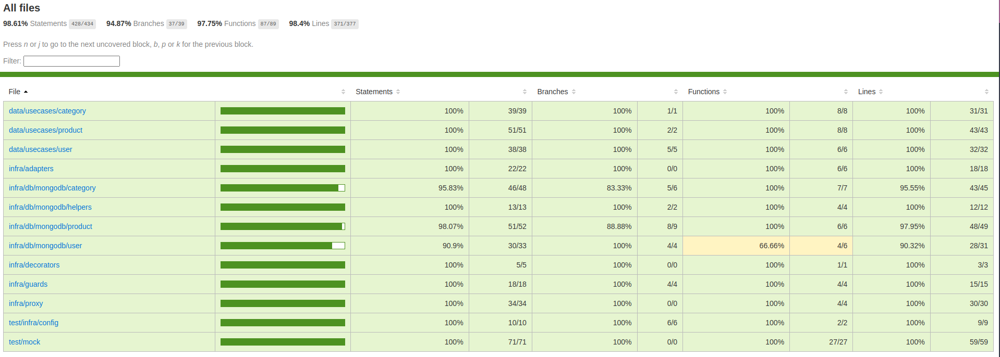

# **Catalog-App**

Essa API é um projeto simples para estudo de Clean Architecture, TDD e AWS, SQS, SNS, Bucket. Ele simula um sistema de gerenciamento de catálogo de produtos em um aplicativo de mercado. As funcionalidades até o momento incluem um CRUD de category e products, onde rotas do tipo DELETE, POST, UPDATE realizam chamadas a aws para salvar e ou atualizar os objetos no bucket.
Rode npm run test:unit para ver os teste unitários e npm run test:verbose para ver com detalhes! (src/test)
[]
[]

  

> ## Princípios Implementados

* Single Responsibility Principle (SRP)
* Open Closed Principle (OCP)
* Liskov Substitution Principle (LSP)
* Interface Segregation Principle (ISP)
* Dependency Inversion Principle (DIP)
* Keep It Simple, Silly (KISS)
* Small Commits

> ## Design Patterns

* Factory
* Dependency Injection

> ## Metodologias e Designs

* TDD
* Clean Architecture
* DDD
* Conventional Commits
* Use Cases
* Continuous Integration

> ## Testes

* Testes Unitários
* Mocks
* Stubs
* Spies
* Fakes

> ## Para todar esse projeto

* Node 18
* NPM
* MongoDB

